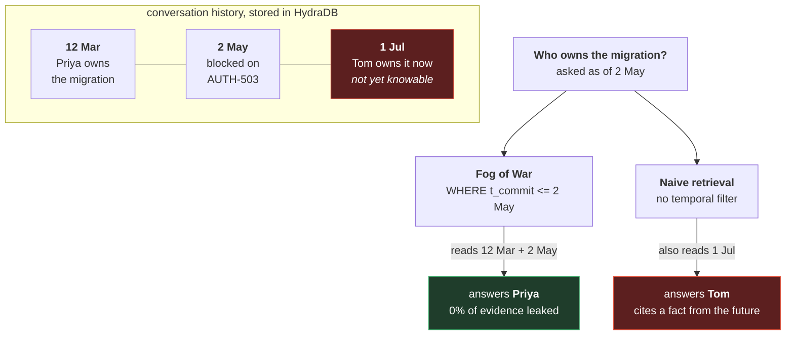
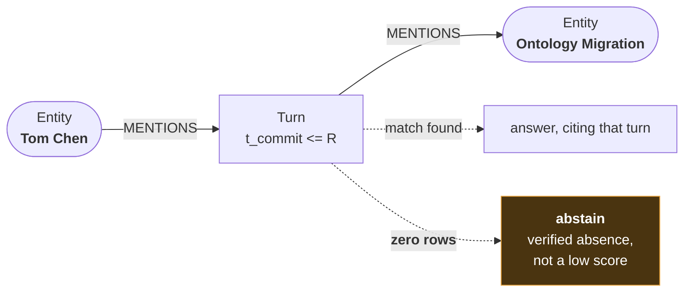
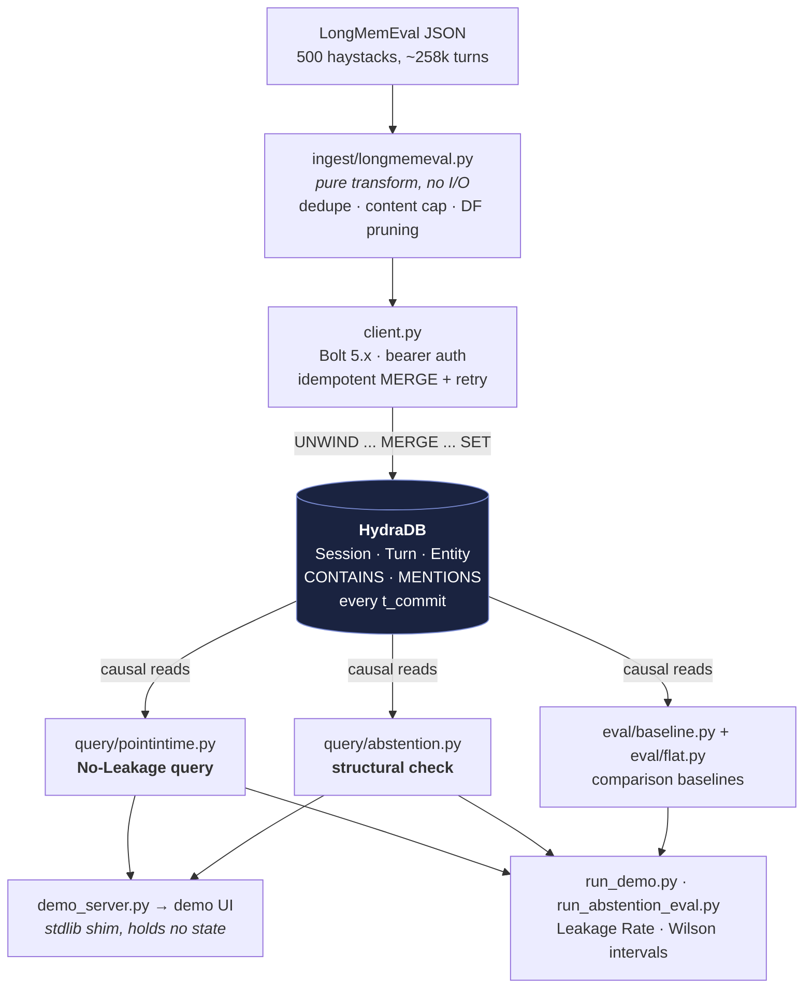
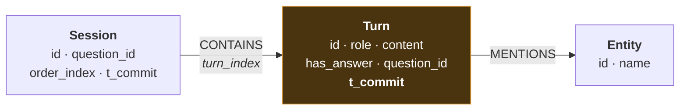

# Fog of War

**Verifiable abstention and look-ahead-bias-free memory for conversational agents, built on [HydraDB](https://github.com/hydra-db/hydradb)'s bitemporal graph engine.**

Built for [Hack Hydra](https://hackhydra.hydradb.com/) (Track 03 — Memory + Context Retrieval), Aug 2026. Everything in this repository — code, evaluation, demo, and the five upstream stability findings — was built during the hackathon window against the newly open-sourced HydraDB.

> *In a strategy game, "fog of war" means you only see what your units have actually scouted — everything past that boundary is genuinely hidden, not guessed at. That's the honesty this system enforces for agent memory: know exactly what you knew, and exactly when you stopped knowing more.*

**Where's HydraDB?** It runs as the server this project talks to over Bolt — every fact stored and every question answered goes through it, with no secondary store, cache, or in-memory index anywhere. The twelve Cypher statements, the bitemporal model, the primitives that are load-bearing, and what breaks without each are mapped line by line in **[`docs/HYDRADB.md`](docs/HYDRADB.md)**.

---

## The problem

Two things go wrong in most agent memory systems, and both are **silent** failures:

1. **Confident wrong answers.** A similarity-based retriever returns *something* for almost any question, even when the fact was never stated — there is no principled cutoff between "I found it" and "I found something merely related."
2. **Hindsight leakage.** Asked *"what did we know as of session 10,"* a system that retrieves "the most relevant facts" can silently answer using a correction that only arrived in session 25 — information it could not honestly have had at that point. In time-series machine learning this failure has a name, **look-ahead bias**, and rigorous tooling to prevent it. In conversational agent memory it has, as far as our literature search found, never been named or measured.

Both are one underlying gap in how memory systems handle time: they track *when something became true* (valid-time) but not *when the system itself learned it* (commit-time). Fog of War fixes both using the commit-time axis that HydraDB's bitemporal edge model already carries.

### What hindsight leakage looks like

A question honestly posed about 2 May must not be answered with a fact the system
only learned on 1 July — even though that fact is sitting right there in the graph:



Both answers are *defensible retrievals*. Only one is honest about time. Measured
across the full benchmark, the naive path's evidence is **42.5% from the future**.

## The two mechanisms

**1 — Point-in-time reconstruction (No-Leakage).** Every ingested turn carries `t_commit`, the timestamp at which the system learned it. A query answered "as of" reference point R filters on `t_commit <= R` — so evidence from after R is excluded *by the WHERE clause itself*, not by a reranker's judgment. The formal property and its (short) proof sketch are in [`docs/architecture.md`](docs/architecture.md).

**2 — Structural abstention, as a routing decision.** For the subset of questions that reduce to an exact relationship check ("do X and Y co-occur in anything we were told?"), a bounded graph traversal that returns **zero rows is a checked fact** — categorically different from a similarity score falling below an arbitrary threshold. Confidence-based retrieval remains the right tool for genuinely fuzzy questions and is untouched; this mechanism only claims the structurally decidable slice, and we measure how big that slice actually is rather than asserting it.

The check is a two-hop traversal through a shared `Turn`. If no such turn exists
within the knowable window, there is nothing to answer *from* — and that absence is
the answer:



## Architecture

Every fact stored and every question answered goes through HydraDB. There is no
secondary store, no cache, and no in-memory index anywhere in the system:



### The graph model

Three vertex types, two relationship types. `t_commit` — *when the system learned
it* — is the property every claim in this project rests on:



Entity vertices are **global** — shared across all 500 questions — which is what makes
cross-question identity possible and also what makes a popular entity expensive to
traverse. That trade-off, and the id-keyed access patterns that keep queries fast, are
in [`docs/HYDRADB.md`](docs/HYDRADB.md).

## Measured results

All numbers below were measured against a live HydraDB node on real [LongMemEval](https://github.com/xiaowu0162/LongMemEval) benchmark data. Nothing is projected or estimated; error and coverage counts are reported, not hidden.

### Leakage — full benchmark

All 500 `longmemeval_s_cleaned` instances ingested (~258k turns, >1.2M edges). Reference point = mid-history session per question. 255/500 questions evaluable (243 lacked an extractable query entity under the v1 regex extractor; 2 errored):

| Mean Leakage Rate (n=255) | |
|---|---|
| Point-in-time query (`t_commit` filter) | **0.0000** |
| Naive full-history baseline (no filter) | **0.4254** |

**On the real benchmark, 42.5% of the naive baseline's cited evidence comes from after the reference point** — information the system could not honestly have had. The filtered query's zero is guaranteed by construction (the No-Leakage property); the baseline's 42.5% is the novel empirical measurement: it quantifies how much hindsight contamination exists in ordinary retrieval over conversation history.

Consistent smaller runs: 100 oracle (evidence-only) instances: 0.0000 vs 0.1229 — the oracle file understates baseline leakage because it omits filler sessions. 25 full haystacks: 0.00 vs 0.40.

### Abstention — LongMemEval's 30 labeled unanswerable questions

With the full history knowable (reference point = last session), of the 6 `_abs` questions the v1 heuristic could reduce to a subject/object pair, the structural check **correctly abstained on 6/6 = 100% (Wilson 95% CI 61.0%–100.0%)** — zero invented answers on the slice it could address.

Honesty about that number: coverage (6/30) is the v1 regex extractor's limitation, not the mechanism's; and with the answerable-side proxy at n=2, a trivial always-abstain baseline is not yet statistically distinguishable — the demo's live abstain→answer flip is an existence proof that the system does answer when evidence exists, but the rate needs a better extractor to measure. Both caveats are why the CI is printed next to the number.

### Structural decidability

100/500 = **20.0%** (Wilson 95% CI 16.7%–23.8%) of benchmark questions reduce to an exact co-occurrence check under the v1 heuristic — an honest bound on the abstention mechanism's reach, measured rather than asserted.

### The ablation that was cut, and why

The full 2×2 grid (graph × temporal-filter) was designed (`docs/architecture.md`) and abandoned at scale for a measured reason: the no-graph cells substring-scan every turn of a question server-side (~60–75s per question; ~19% exceed HydraDB's 30s runtime budget), projecting to 10+ hours for 500 questions. The cost asymmetry is itself a finding — the graph-indexed cells return in milliseconds. Structure isn't just correcter; it's cheaper.

## The demo — a temporal debugger

```bash
python scripts/demo_server.py    # HydraDB must be running; then open http://127.0.0.1:8377
```

A draggable **fog boundary** over the conversation timeline: everything after it is veiled — present, but not yet knowable. The left panel shows exactly what the live query returned. Toggling **naive (no filter)** runs the real unfiltered query, and future evidence visibly leaks through the veil in red, tagged "FROM THE FUTURE." The right panel runs the structural abstention check and prints the actual traversal trace — `0 rows` is a checked fact, not a low similarity score.

Two scenarios: a constructed ownership-handoff story (the clearest 60-second demonstration) and a real LongMemEval question served from its 49 real benchmark sessions. **Every number on the page arrives over Bolt from the live database; nothing is canned** — the server (`scripts/demo_server.py`, stdlib-only) is a thin JSON shim over the same query modules the evaluation uses.

## Reproduction, start to finish

**1. Python environment (no HydraDB needed for the test suite):**

```bash
python -m venv .venv
.venv/Scripts/activate            # .venv/bin/activate on macOS/Linux
pip install -e ".[dev]"
pytest tests/                     # 35 tests — includes a regression test for every bug found live
```

**2. HydraDB in Docker.** Follow HydraDB's own README quickstart, with two Windows-specific deviations we discovered live (skip these on Linux/macOS):

- **Named volume, not a bind mount** — the container's UID 10001 can't write Windows bind mounts:
  ```bash
  docker volume create hydradb-data
  docker run --rm -v hydradb-data:/data busybox sh -c "mkdir -p /data/store /data/cache && printf '%s\n' 'local-development-token-32-bytes' > /data/auth-token && chown -R 10001:10001 /data"
  ```
- **Set the workdir to the volume** (`-w /data -e HOME=/data`) — the image ships an empty WorkingDir (= `/`, unwritable for UID 10001) and dies at startup with a bare `PermissionDenied` otherwise.

Then run the image with HydraDB's documented environment block (`GRAPH_ALLOW_PLAINTEXT=true`, ports 7687/8443/9090, `-v hydradb-data:/data`) — **but set `RUST_MIN_STACK=134217728`**, not the README's 32MB (see finding #1 below).

**3. Data + evaluation:**

```bash
python scripts/download_longmemeval.py                 # ~290MB from HuggingFace
python scripts/run_demo.py --data data/raw/longmemeval_s_cleaned.json --limit 500 --ingest-chunk 25 --throttle-s 2
python scripts/run_abstention_eval.py --data data/raw/longmemeval_s_cleaned.json
```

Ingesting all 500 instances takes tens of minutes. `scripts/run_campaign.ps1` (Windows) runs it as resumable strides in fresh processes with automatic retry, so a transient failure costs one stride rather than the whole run — every write is an idempotent `MERGE`, so repeating a stride is harmless. Re-run only the evaluation against an already-populated graph with `--skip-ingest`.

## How HydraDB is used (and what breaks without it)

**Full map with file:line citations: [`docs/HYDRADB.md`](docs/HYDRADB.md).** In brief — four of its primitives are load-bearing:

- **Bitemporal edges.** Every turn carries `t_commit` (when the system learned it) alongside valid-time — the `(u, r, v, t_commit, t_valid, m)` shape from HydraDB's own memory-layer write-up, applied to a problem it wasn't proposed for: guaranteeing a query answered "as of" a point in a conversation cannot cite evidence learned later. Filtering `t_valid` instead answers a different, wrong question — a backdated correction is *valid* early but was not *knowable* early.
- **Two-hop traversal as the abstention mechanism.** `(subject)<-[:MENTIONS]-(Turn)-[:MENTIONS]->(object)` returning zero rows is a checked fact. A vector index cannot express this query, let alone return a meaningful empty result — similarity search always hands back a ranked list.
- **`MERGE` idempotency as a reliability primitive.** Because every write is `UNWIND … MERGE … SET`, retrying a batch is safe by construction — which is what makes ingesting 500 haystacks resumable in strides.
- **Causal vs. strong read consistency**, wired through the client layer: `causal` for interactive polling, `strong` for a result that must be provably fresh before it's reported as final.

Designing inside the documented Cypher subset (no `IN`, no `IS NULL`, no `CONTAINS`, one relationship type per pattern, one statement per request) shaped the schema directly: integer node ids via stable hashing, an `i64::MAX` sentinel instead of NULL for open validity intervals, and co-occurrence expressed as two single-type hops through a shared `Turn`.

## Repository layout

```
src/fogofwar/
  schema.py                bitemporal conventions, stable ids, batched-write templates
  client.py                Bolt client: bearer auth, idempotent-retry writes, consistency modes
  extract.py               v1 entity extraction (regex heuristic, deliberately swappable)
  ingest/longmemeval.py    benchmark -> graph transform: dedupe, content cap, DF hub pruning
  query/pointintime.py     the No-Leakage query (t_commit <= R)
  query/abstention.py      the structural co-occurrence check
  eval/metrics.py          Leakage Rate, Structural Decidability, Wilson intervals
  eval/baseline.py         naive full-history baseline
  eval/flat.py             no-graph ablation cells
scripts/
  download_longmemeval.py  dataset fetch
  run_demo.py              ingest + evaluation CLI (all results above came from this)
  run_abstention_eval.py   the 30-question abstention evaluation
  run_campaign.ps1         supervised, resumable ingest in fresh-process strides
  demo_server.py           stdlib JSON shim serving the demo UI from live queries
demo/index.html            the temporal-debugger UI
docs/HYDRADB.md            every Cypher statement, primitive, and access-pattern lesson
docs/architecture.md       formal claims, ablation design, limitations
tests/                     35 tests; every live-discovered bug has a regression test
```

## Findings against HydraDB (v0.1, discovered and bisected during the build)

The hackathon FAQ says the point of open-sourcing is to "show us what works, expose what does not." Five reproducible findings, most precise first:

1. **Records over ~32KiB deterministically panic the write path.** Bisected with single-row writes: a 30,000-byte `content` property writes fine; 32,767 bytes fails every time (`"corrupt value at client/query/executor: query executor panicked"`, panic at `slatedb/src/batch.rs:154`; the node stays up; retry never succeeds). Real chat data hits this — the longest LongMemEval turn is 42,347 bytes. Workaround: content cap at ingest (`MAX_CONTENT_BYTES`).
2. **`DETACH DELETE` scans the whole cell, not the vertex's edges.** Deleting a one-edge vertex fails on a >1M-edge graph (`delete_vertex_scan_relationships rejected by admission control: actual 1000001 exceeds limit 1000000`, 3/3 deterministic). Practical consequence: vertex deletion is unusable past ~1M edges per cell — relevant to any GDPR-style erasure story. Our own connection probe originally cleaned up with `DETACH DELETE` and began failing purely because the database had grown; it is now MERGE-idempotent.
3. **`graph-node` segfaults under sustained write load at the README's own `RUST_MIN_STACK=32MB`** (container exit 139 shortly after SlateDB L0 compaction starts; client sees `SessionExpired`). 128MB survives the identical workload. The README documents a stack-overflow failure mode for queries, but not this write/compaction-load variant.
4. **Unindexed property label-scans exceed the runtime budget at moderate scale.** `MATCH (s:Session) WHERE s.question_id = ...` over ~24k vertices times out (30s+). Everything in this repo keys by deterministic integer id instead — worth documenting as the intended access pattern.
5. **The garbage collector logs `NotImplemented` errors continuously on the local-filesystem store** (`error collecting garbage [resource=Manifest, ...]`), so disk usage only grows in local dev mode. Cosmetic, but noisy and initially alarming.

Client-side honorable mention: the `neo4j` Python driver's pure-Python packstream packer crashed twice under this workload's large payloads; `neo4j-rust-ext` bypasses that path and is a hard dependency here.

## Limitations, stated plainly

- **Entity extraction is a regex heuristic.** It caps evaluable coverage at 255/500 questions and abstention coverage at 6/30. Swapping in an NER/LLM extractor is the single highest-leverage improvement; the module is deliberately isolated so nothing downstream changes.
- **Leakage Rate measures retrieval hygiene, not answer quality.** We show the evidence set is temporally honest, not that final answers improve — the end-to-end answer-quality evaluation (generate from fog-vs-naive evidence, score against LongMemEval's ground truth) is designed and deferred, and is the top item on the roadmap.
- **The abstention result is small-n** (see the CI), and the always-abstain control is not yet run.
- The 255 evaluable questions are the entity-extractable subset — a possible selection effect we report rather than rule out.

## Datasets & attribution

- [LongMemEval](https://github.com/xiaowu0162/LongMemEval) (Wu et al., ICLR 2025), via the maintainers' [cleaned HuggingFace release](https://huggingface.co/datasets/xiaowu0162/longmemeval-cleaned). 30 of its 500 questions are labeled abstention cases.
- [HydraDB](https://github.com/hydra-db/hydradb) (AGPL-3.0) — the database this is built on, run unmodified from the published Docker image.
- [neo4j Python driver](https://github.com/neo4j/neo4j-python-driver) + `neo4j-rust-ext` (Apache-2.0) — Bolt connectivity.
- [BEAM](https://github.com/mohammadtavakoli78/BEAM) (Tavakoli et al., ICLR 2026) — cited as the planned second benchmark; not yet integrated.

## License

MIT — see [`LICENSE`](LICENSE).
